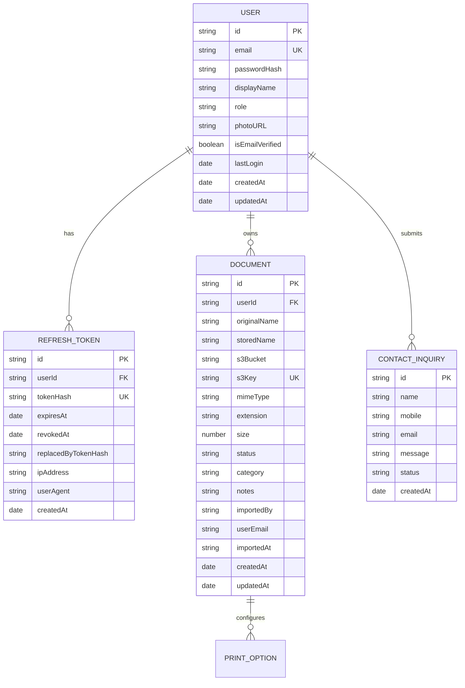

# Frontend Analysis: ACS Customer Service Centre

## 1. Executive Summary

This document provides a thorough analysis of the **ACS Customer Service Centre** frontend application deployed at [https://acs-customer-service-centre-1.vercel.app/](https://acs-customer-service-centre-1.vercel.app/). 

The analysis was performed by inspecting the compiled production client bundle (`index-BRWV_mdl.js`), reverse-engineering component trees, routing tables, state storage, form fields, and user interaction pathways.

---

## 2. Application Identity & Purpose

- **Application Title:** ACS Customer Service Centre
- **Brand Identity:** ACS (Digital Document Processing & Print Management / Cyber Cafe & Online Services Portal)
- **Tagline:** Fast, reliable digital document and customer service portal.
- **Primary Mission:** Allow customers to digitally import/upload documents for printing, scanning, cyber cafe services, utility forms, and government applications, while desk staff (Admins) track, inspect, process, and complete orders via a real-time management queue.

---

## 3. Frontend Pages & Routing Structure

The frontend is a Single Page Application (SPA) built with React and React Router:

| Route | Component | Access Level | Description |
| :--- | :--- | :--- | :--- |
| `/` | `Home` (`OP`) | Public | Landing page with the central pulsing document import drop-zone, file preview confirmation, service offerings, metrics, and contact inquiry footer. |
| `/user-dashboard` | `UserDashboard` (`LP`) | Protected (`USER` role) | Customer dashboard displaying their imported document history, status filters (`all`, `ready`, `processing`, `completed`), search by title/category, quick upload button, and document viewer modal. |
| `/admin-dashboard` | `AdminDashboard` (`kP`) | Protected (`ADMIN` role) | Desk Admin console displaying queue metrics, filterable list of all submitted customer documents, status toggle (`Complete` / `Ready`), document editor modal, deletion, and preview. |
| `*` | Catch-all | Public | Redirects to `/`. |

---

## 4. Modals & Dialogs

### 4.1 Login & Authentication Modal (`SP`)
- **Trigger:** Click on "Customer Login", "Desk Admin Login", or "Dashboard" when unauthenticated.
- **Tabs/Modes:**
   1. **Customer User Tab (`role = 'user'`):** Sign in or register with an ACS account.
   2. **Desk Admin Tab (`role = 'admin'`):** Sign in or register with an authorized ACS account.
- **Backend Auth Support:** The backend provides JWT authentication (Register, Login, Refresh, Logout, Password Management) for real ACS accounts.

### 4.2 Document Viewer & Print Modal (`x1`)
- **Trigger:** Clicking on any document card or row in either the User Dashboard or Admin Dashboard.
- **Capabilities:**
  - File preview with support for PDF, Word, Excel, Images, and Text.
  - Zoom controls: Zoom in, Zoom out, Reset zoom (`100%`).
  - Rotation controls: Rotate clockwise (`0°`, `90°`, `180°`, `270°`).
  - Print Configuration:
    - Orientation: `portrait` or `landscape`
    - Color Mode: `color`, `grayscale`, or `bw`
    - Paper Size: `A4`, `A3`, `Letter`, `Legal`
    - Copies: Integer (default `1`)
  - Official Watermark Toggle: "Official Customer Service Document" header with Reference ID and Seal ("✓ APPROVED & PROCESSED" or "✓ VERIFIED FOR PROCESSING").
  - Action Buttons:
    - **Print Document:** Triggers browser print iframe.
    - **Download File:** Downloads document file from the secure storage URL.
    - **Status Change:** (Admin only) Mark as complete or reset to ready.
    - **Delete Document:** Permanently remove record.

### 4.3 Edit Document Modal (`MP`)
- **Trigger:** Clicking the pencil/edit icon on a document in the Admin Dashboard.
- **Fields:**
  - `name`: Document title/display name (string, required).
  - `category`: Category string (e.g. `Print Job`, `Document Scanning`, `Online Application`, `Utility Bill`, `Govt ID Service`).
  - `status`: Select dropdown with values `ready`, `pending`, `processing`, `completed`.
  - `notes`: Textarea for customer or staff instructions.
- **Action:** Submits update payload to backend.

---

## 5. Document Upload & Processing Workflows

### 5.1 Public / Home Page Import Workflow
1. User clicks or drops a file into the pulsing circular radar upload area (`#main-ping-import-area`).
2. Frontend inspects the file object:
   - Allowed types: PDF, Word (`.doc`, `.docx`), Excel (`.xls`, `.xlsx`, `.csv`), Images (`.png`, `.jpg`, `.jpeg`, `.webp`, `.svg`, `.gif`), Text (`.txt`, `.json`, `.xml`, `.csv`, `.log`, `.md`, `.html`).
   - File size check.
3. **Confirmation Card (`NP`):** Displays file icon, filename, formatted size, and category badge. User can click "Clear", "Change File", or "Confirm Import".
4. **On "Confirm Import":**
   - File is sent to the backend.
   - Backend uploads the file to AWS S3 and creates the metadata record in MongoDB.
   - **Success Card:** Displays a green success banner with the generated Document Reference ID, document summary, and a "View in Dashboard" button.

### 5.2 Dashboard Upload Workflow
- From `/user-dashboard` or `/admin-dashboard`, users can click the "Import File" or "+" button to upload a document directly into their queue.

---

## 6. Document Access & Download Workflow

1. User or Admin requests a document download from the table or inside the Viewer Modal.
2. The client invokes `GET /api/v1/documents/:id/download`.
3. The backend:
   - Verifies the user is authenticated.
   - Verifies the user owns the document (or is an `ADMIN`).
   - Generates an AWS S3 presigned URL using `@aws-sdk/s3-request-presigner` with short expiration (e.g., 300 seconds / 5 minutes).
   - Returns the presigned download URL and expiration time.
4. The client uses the signed URL to download or render the file directly from private S3 storage.

---

## 7. Search, Filtering, and Sorting Requirements

### 7.1 Customer Dashboard (`/user-dashboard`)
- **Status Tabs:** `all`, `ready`, `processing`, `completed`.
- **Search:** Case-insensitive search on document name.
- **Sorting:** Most recent first (`createdAt` descending).

### 7.2 Admin Console (`/admin-dashboard`)
- **Status Filter:** `all`, `ready`, `processing`, `completed`.
- **Category Filter:** Filter by specific document category (e.g., `Print Job`, `Scanning`).
- **Global Search:** Search by document name, customer display name (`importedBy`), customer email (`userEmail`), or Document Reference ID.
- **Sorting:** By creation date descending.

---

## 8. User Roles & Authorization

1. **`USER` (Customer):**
   - Can upload documents.
   - Can view and download their own documents.
   - Can delete their own documents.
   - Can update their own profile and password.
   - Cannot view or modify other users' documents.
   - Cannot access `/admin-dashboard` or admin endpoints.

2. **`ADMIN` (Desk Admin):**
   - Full access to `/admin-dashboard`.
   - Can view all documents across all users in the queue.
   - Can update document status (`ready`, `processing`, `completed`, `pending`).
   - Can edit document metadata (name, category, notes).
   - Can download any document in the system.
   - Can delete any document.
   - Can view admin statistics (total documents, pending queue, completed, active customers).

---

## 9. Contact & Inquiry Workflow

- Located in the page footer (`#footer-section`).
- **Fields:**
  - `name`: Customer full name.
  - `mobile`: Phone number.
  - `email`: Email address.
  - `message`: Service inquiry or assistance request.
- **Actions:** Prepares a structured WhatsApp message and also dispatches the lead/inquiry to the backend API (`POST /api/v1/contact`).

---

## 10. Inferred Entity Models & Relationships

---

## 11. Assumptions & Frontend Gaps

To maintain engineering rigor, the following assumptions are documented:

1. **ASSUMPTION 1 (Local Demo State vs Production Backend):**
   The deployed frontend uses Firebase Auth and client-side `localStorage` / Firestore mocks (`acs_imported_documents`, `acs_auth_user`). The production backend replaces this with a full RESTful API using MongoDB, JWT authentication (access + refresh tokens), and AWS S3 object storage.
2. **ASSUMPTION 2 (Password Policy):**
   Minimum 8 characters, containing at least one uppercase letter, one lowercase letter, one number, and one special character.
3. **ASSUMPTION 3 (S3 Signed URL Expiration):**
   Presigned download URLs will expire after 300 seconds (5 minutes) to prevent link forwarding while giving customers adequate time to stream or download their files.
4. **ASSUMPTION 4 (File Upload Limit):**
   The maximum file size supported by the backend upload endpoint will be set to 25 MB.
